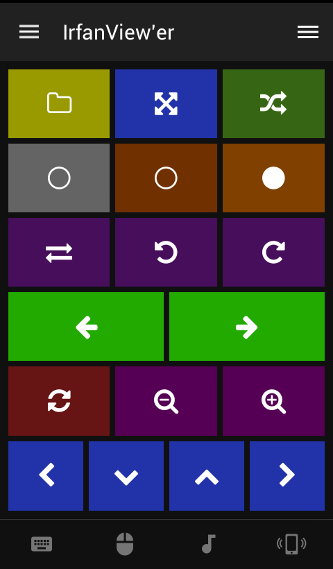

# Irfan View Advance
Irfan remote for Unified Remote for viewing photos.

version 1.1
released 2016-01-01

## Features 

###Short click actions

- Folder browser with navigation
- Full screen
- Random image in the folder
 
- View in greyscale
- Less brightness (gamma)
- More brightness (gamma)

Flip horizontal (mirror view)
Rotate left
Rotate right

Previous image
Next image
 
Toggle image size / aspect
Zoom out 
Zoom in

Arrows (zoom navigation)

###Long press actions

- Save modified file in the original folder with -rem suffix (be sure that you set the quality for saving)
- Exit fullscreen, Irfan View, Close other apps, Turn off PC (Alt+F4)
- Slideshow start/stop

- Maximum saturation (colour intensity)
- Less saturation
- More saturation

- Flip vertical
- Rotate left 45 deg
- Rotate right 45 deg

- 5 images back
- 5 images forward

- Reload original image
- Zoom fit to screen
- Show original size

- Open a defined image (temporarily not working)
- One folder down
- One folder up
- Start Irfan View

- No delete file button

## Screenshots

## Support
Developed by **Abrimaal**  
http://community.unifiedremote.com/topic/42/remote-for-irfan-view
